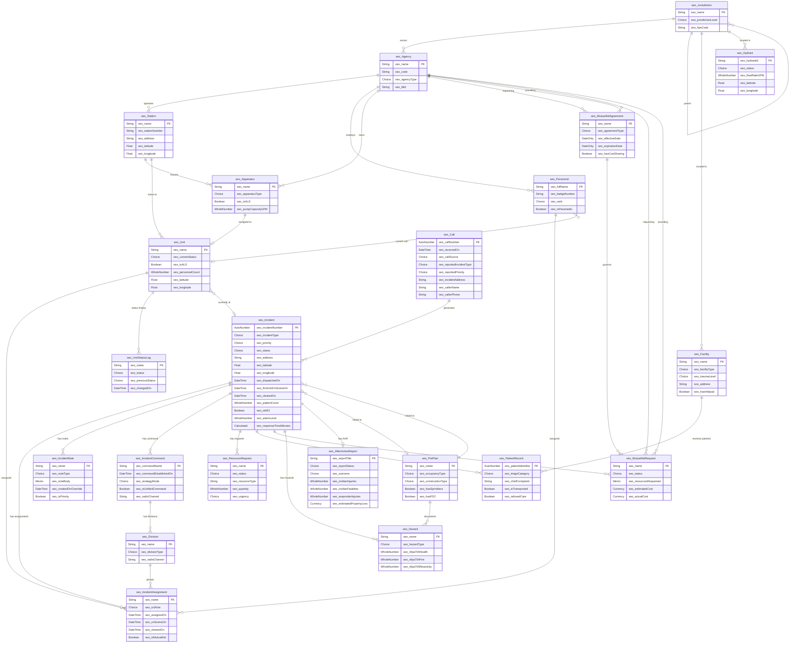

# EmergencyResponseCoordination — Technical Documentation

> **Audience:** Developers, solution architects, Dataverse admins
> **Platform:** Microsoft Power Platform / Dataverse (GCC)
> **Publisher:** StateEmergencyOps | **Prefix:** seo

---

## Table of Contents

1. [Architecture Overview](#architecture-overview)
2. [Architecture Decisions](#architecture-decisions)
3. [Data Model — Entity Relationship Diagram](#data-model--entity-relationship-diagram)
4. [Data Dictionary](#data-dictionary)
5. [Global Choice (Option Set) Definitions](#global-choice-option-set-definitions)
6. [Security Model](#security-model)
7. [ALM & Deployment](#alm--deployment)

---

## Architecture Overview

```
┌──────────────────────────────────────────────────────────────────┐
│                        GCC Dataverse                             │
│  ┌─────────────────────────────────────────────────────────────┐ │
│  │           EmergencyResponseCoordination Solution            │ │
│  │                                                             │ │
│  │  ┌──────────┐ ┌──────────┐ ┌──────────┐ ┌──────────────┐  │ │
│  │  │  Tables   │ │ Choices  │ │ Security │ │  Env Vars /  │  │ │
│  │  │  (20+)   │ │ (Global) │ │  Roles   │ │  Conn Refs   │  │ │
│  │  └──────────┘ └──────────┘ └──────────┘ └──────────────┘  │ │
│  └─────────────────────────────────────────────────────────────┘ │
│                                                                  │
│  ┌─────────────┐  ┌──────────────┐  ┌────────────────────────┐  │
│  │ Canvas App  │  │ Model-Driven │  │   Power Automate       │  │
│  │ (Responder) │  │ (Dispatch)   │  │   Flows                │  │
│  │ Phase 4     │  │ Phase 5      │  │   Phase 3              │  │
│  └─────────────┘  └──────────────┘  └────────────────────────┘  │
│                                                                  │
│  ┌──────────────────────┐  ┌─────────────────────────────────┐  │
│  │   Power BI Reports   │  │   GCC Auth / Deployment         │  │
│  │   Phase 6            │  │   Phase 7                       │  │
│  └──────────────────────┘  └─────────────────────────────────┘  │
└──────────────────────────────────────────────────────────────────┘
```

### Operational Domains

| Domain | Tables | Description |
|--------|--------|-------------|
| **Core** | Agency, Jurisdiction, Facility | Organizational structure and reference data |
| **Call/Incident Intake** | Call, Incident | 911 calls and incident lifecycle management |
| **Dispatch** | Unit, Apparatus, Station, Personnel, IncidentAssignment, UnitStatusLog | Resource management and dispatch operations |
| **ICS Command** | IncidentCommand, Division, ResourceRequest, IncidentNote | Incident Command System structure and communications |
| **EMS** | PatientRecord | Patient care tracking (PHI-protected) |
| **Mutual Aid** | MutualAidAgreement, MutualAidRequest | Inter-agency resource sharing |
| **After-Action** | AfterActionReport | Post-incident analysis and reporting |
| **Planning** | PrePlan, Hazard, Hydrant | Pre-incident planning and reference data |

---

## Architecture Decisions

### ADR-001: Separate Call and Incident Entities
**Decision:** Calls and incidents are separate tables with a 1:N relationship.
**Rationale:** A single 911 call can generate multiple incidents (e.g., MVA with fire and EMS), and multiple calls can report the same incident. Separating them preserves the call intake workflow and enables duplicate-call detection.

### ADR-002: Unit as a Dispatchable Abstraction
**Decision:** Unit is an abstraction separate from Apparatus and Personnel.
**Rationale:** A "unit" in fire/EMS is a crew+apparatus combination that may change between shifts. Engine 1 today may be a different physical apparatus and crew than Engine 1 tomorrow. The Unit entity represents the dispatchable concept, with lookups to the current Apparatus and Personnel.

### ADR-003: UnitStatusLog as Append-Only Audit Trail
**Decision:** Every unit status change creates a new UnitStatusLog row rather than updating a history on the Unit table.
**Rationale:** Provides an immutable audit trail for response-time metrics, ISO accreditation, and legal documentation. The Unit table holds `currentStatus` for quick dispatch queries. Audit is disabled on UnitStatusLog since it IS the audit trail.

### ADR-004: IncidentAssignment as a Flexible Join Table
**Decision:** IncidentAssignment connects Incidents to Units AND/OR Personnel with ICS role and timestamps.
**Rationale:** An assignment can be a unit dispatch (Unit + Incident), a personnel ICS role (Personnel + Incident), or both. This supports both traditional dispatch ("send Engine 1") and ICS structure ("assign Captain Smith as Division A Supervisor").

### ADR-005: PHI Fields Flagged for Column-Level Security
**Decision:** PatientRecord columns containing Protected Health Information are flagged with `"phi": true` in the schema.
**Rationale:** HIPAA compliance requires field-level access control. In Phase 2 (Security), these fields will get Dataverse column-level security profiles restricting access to EMS personnel only.

### ADR-006: Hydrant Entity Included
**Decision:** Include seo_Hydrant as a separate entity.
**Rationale:** Hydrant locations are critical for fire pre-planning and on-scene water supply decisions. They'll display on the mobile app map (Phase 4) and link to pre-plans. Most agencies maintain hydrant data in GIS — we'll support bulk import. Audit disabled since this is reference data.

### ADR-007: Mutual Aid Agreement vs. Request Separation
**Decision:** Standing agreements (MutualAidAgreement) are separate from per-incident requests (MutualAidRequest).
**Rationale:** Agreements are administrative documents that exist independent of incidents (effective dates, terms, cost sharing). Requests are operational records tied to a specific incident. A request may or may not reference a standing agreement.

### ADR-008: ICS Command Structure as Separate Entities
**Decision:** IncidentCommand and Division are separate tables, not embedded in Incident.
**Rationale:** Enables command transfer tracking (multiple IC records per incident), division/group structure modeling, and proper ICS documentation. Small incidents won't use divisions; large incidents will have full ICS structure.

### ADR-009: Calculated Fields — Keep It Lean
**Decision:** Only two calculated fields on Incident (responseTimeMinutes, totalDurationMinutes). No rollup fields in Phase 1.
**Rationale:** Calculated fields in Dataverse have limitations and performance implications. Response time and duration are the most critical metrics and justify the overhead. Additional rollups can be added when needed or handled in Power BI (Phase 6).

### ADR-010: GCC Dataverse Constraints
**Decision:** Design for GCC (Government Community Cloud) from day one.
**Rationale:** GCC has specific connector limitations, geographic residency requirements, and security baselines. Environment variables and connection references are used exclusively for environment-specific configuration to support solution transport between Dev → Test → Prod.

---

## Data Model — Entity Relationship Diagram



---

## Data Dictionary

### seo_Jurisdiction

| Column | Type | Required | Description |
|--------|------|----------|-------------|
| seo_name | String(200) | Yes | Jurisdiction name |
| seo_jurisdictionLevel | Choice | Yes | State, County, City, Town/Township, Fire Protection District, EMS District, Other |
| seo_parentJurisdictionId | Lookup → seo_Jurisdiction | No | Hierarchical parent |
| seo_fipsCode | String(10) | No | Federal Information Processing Standards code |
| seo_boundaryGeoJSON | Memo | No | GeoJSON polygon for geo-dispatch |
| seo_isActive | Boolean | Yes | Default: true |

### seo_Agency

| Column | Type | Required | Description |
|--------|------|----------|-------------|
| seo_name | String(200) | Yes | Full legal name |
| seo_code | String(20) | Yes | Short unique ID (e.g., FDNY) |
| seo_agencyType | Choice | Yes | Fire Department, EMS Agency, Combined Fire/EMS, Rescue Squad, Hazmat Team, Law Enforcement, Other |
| seo_jurisdictionId | Lookup → seo_Jurisdiction | No | Primary jurisdiction |
| seo_address | String(500) | No | HQ address |
| seo_phone | String(20) | No | Phone |
| seo_email | String(200) | No | Email |
| seo_isActive | Boolean | Yes | Default: true |
| seo_fdid | String(10) | No | NFIRS Fire Department ID |

### seo_Station

| Column | Type | Required | Description |
|--------|------|----------|-------------|
| seo_name | String(100) | Yes | Station name |
| seo_stationNumber | String(10) | Yes | Station number |
| seo_agencyId | Lookup → seo_Agency | Yes | Operating agency |
| seo_address | String(500) | Yes | Physical address |
| seo_latitude | Float(6) | No | GPS latitude |
| seo_longitude | Float(6) | No | GPS longitude |
| seo_isActive | Boolean | Yes | Default: true |
| seo_phone | String(20) | No | Station phone |

### seo_Apparatus

| Column | Type | Required | Description |
|--------|------|----------|-------------|
| seo_name | String(50) | Yes | Designator (e.g., Engine 1) |
| seo_apparatusType | Global Choice | Yes | Engine, Ladder/Truck, Rescue/Squad, Ambulance/Medic, etc. |
| seo_stationId | Lookup → seo_Station | Yes | Home station |
| seo_agencyId | Lookup → seo_Agency | Yes | Owning agency |
| seo_vin | String(20) | No | Vehicle ID |
| seo_yearMakeModel | String(100) | No | Year/make/model |
| seo_seatingCapacity | WholeNumber | No | Crew seats |
| seo_pumpCapacityGPM | WholeNumber | No | Pump capacity (GPM) |
| seo_tankCapacityGal | WholeNumber | No | Tank capacity (gallons) |
| seo_isALS | Boolean | No | Advanced Life Support capable. Default: false |
| seo_isInService | Boolean | Yes | Default: true |

### seo_Unit

| Column | Type | Required | Description |
|--------|------|----------|-------------|
| seo_name | String(50) | Yes | Unit designator (e.g., E1, M7) |
| seo_currentStatus | Global Choice | Yes | Available, Dispatched, En Route, On Scene, Transporting, At Hospital, Returning, Out of Service, Staging. Default: Available |
| seo_apparatusId | Lookup → seo_Apparatus | No | Currently assigned apparatus |
| seo_stationId | Lookup → seo_Station | Yes | Home station |
| seo_agencyId | Lookup → seo_Agency | Yes | Agency |
| seo_currentIncidentId | Lookup → seo_Incident | No | Active incident (null if available) |
| seo_personnelCount | WholeNumber | No | Current crew count |
| seo_isALS | Boolean | No | ALS staffed. Default: false |
| seo_latitude | Float(6) | No | GPS lat (mobile-updated) |
| seo_longitude | Float(6) | No | GPS lon (mobile-updated) |
| seo_lastStatusChangeOn | DateTime | No | Most recent status change timestamp |

### seo_Personnel

| Column | Type | Required | Description |
|--------|------|----------|-------------|
| seo_fullName | String(200) | Yes | Full name |
| seo_badgeNumber | String(20) | No | Badge/ID number |
| seo_rank | Global Choice | Yes | Firefighter through Fire Chief, EMT-Basic through Paramedic, Dispatcher, Volunteer |
| seo_agencyId | Lookup → seo_Agency | Yes | Employing agency |
| seo_currentUnitId | Lookup → seo_Unit | No | Current shift unit assignment |
| seo_certifications | String(500) | No | Comma-separated certifications |
| seo_isParamedic | Boolean | No | Default: false |
| seo_email | String(200) | No | Email |
| seo_phone | String(20) | No | Phone |
| seo_systemUserId | Lookup → systemuser | No | Dataverse user for auth |
| seo_isActive | Boolean | Yes | Default: true |

### seo_Call

| Column | Type | Required | Description |
|--------|------|----------|-------------|
| seo_callNumber | AutoNumber | Yes | CALL-{SEQNUM:7} |
| seo_receivedOn | DateTime | Yes | Call receipt timestamp |
| seo_callSource | Global Choice | Yes | 911, Non-Emergency, Radio, Walk-In, Automatic Alarm, Mutual Aid Request, Transfer, Self-Initiated |
| seo_callerName | String(200) | No | Caller's name |
| seo_callerPhone | String(20) | No | Callback number |
| seo_callerAddress | String(500) | No | Caller's address |
| seo_reportedIncidentType | Global Choice | Yes | What the caller reports |
| seo_reportedPriority | Global Choice | Yes | Initial priority assessment |
| seo_incidentAddress | String(500) | Yes | Location of the emergency |
| seo_latitude | Float(6) | No | Geocoded lat |
| seo_longitude | Float(6) | No | Geocoded lon |
| seo_narrativeNotes | Memo | No | Dispatcher notes |
| seo_jurisdictionId | Lookup → seo_Jurisdiction | No | Determined jurisdiction |
| seo_dispatcherId | Lookup → seo_Personnel | No | Dispatcher who took the call |
| seo_isDuplicate | Boolean | No | Duplicate flag. Default: false |
| seo_duplicateOfIncidentId | Lookup → seo_Incident | No | Incident this duplicates |

### seo_Incident

| Column | Type | Required | Description |
|--------|------|----------|-------------|
| seo_incidentNumber | AutoNumber | Yes | INC-{DATEFMT:yyyyMMdd}-{SEQNUM:5} |
| seo_callId | Lookup → seo_Call | No | Originating call |
| seo_incidentType | Global Choice | Yes | Confirmed incident type |
| seo_priority | Global Choice | Yes | Priority level |
| seo_status | Global Choice | Yes | Reported → Dispatched → En Route → On Scene → Under Control → Overhaul → Cleared → Closed. Default: Reported |
| seo_address | String(500) | Yes | Incident location |
| seo_latitude | Float(6) | No | GPS lat |
| seo_longitude | Float(6) | No | GPS lon |
| seo_crossStreet | String(200) | No | Cross street or landmark |
| seo_apartment | String(50) | No | Apt/suite/floor |
| seo_jurisdictionId | Lookup → seo_Jurisdiction | No | Jurisdiction |
| seo_primaryAgencyId | Lookup → seo_Agency | Yes | Agency with primary responsibility |
| seo_dispatchedOn | DateTime | No | Dispatch timestamp |
| seo_firstUnitEnRouteOn | DateTime | No | First unit en route |
| seo_firstUnitOnSceneOn | DateTime | No | First unit on scene — key metric |
| seo_underControlOn | DateTime | No | Under control timestamp |
| seo_clearedOn | DateTime | No | All units cleared |
| seo_closedOn | DateTime | No | Incident closed |
| seo_patientCount | WholeNumber | No | Number of patients. Default: 0 |
| seo_isMCI | Boolean | No | Mass casualty incident. Default: false |
| seo_alarmLevel | WholeNumber | No | Alarm level. Default: 1 |
| seo_narrativeSummary | Memo | No | Incident narrative |
| seo_hazardsOnScene | Memo | No | Known hazards for responding units |
| seo_prePlanId | Lookup → seo_PrePlan | No | Linked pre-plan |
| seo_nfirsCode | String(10) | No | NFIRS incident type code |
| **seo_responseTimeMinutes** | **Calculated** | — | DATEDIFF(dispatchedOn, firstUnitOnSceneOn, min) |
| **seo_totalDurationMinutes** | **Calculated** | — | DATEDIFF(dispatchedOn, clearedOn, min) |

### seo_IncidentAssignment

| Column | Type | Required | Description |
|--------|------|----------|-------------|
| seo_name | String(200) | Yes | Auto: "Unit X - Incident Y" |
| seo_incidentId | Lookup → seo_Incident | Yes | Incident |
| seo_unitId | Lookup → seo_Unit | No | Assigned unit |
| seo_personnelId | Lookup → seo_Personnel | No | Assigned individual |
| seo_icsRole | Global Choice | No | ICS/NIMS role |
| seo_divisionId | Lookup → seo_Division | No | ICS division |
| seo_assignedOn | DateTime | Yes | Assignment timestamp |
| seo_enRouteOn | DateTime | No | En route timestamp |
| seo_onSceneOn | DateTime | No | On scene timestamp |
| seo_clearedOn | DateTime | No | Cleared timestamp |
| seo_assignmentNotes | Memo | No | Tactical details |
| seo_isMutualAid | Boolean | No | Mutual aid resource. Default: false |

### seo_UnitStatusLog

| Column | Type | Required | Description |
|--------|------|----------|-------------|
| seo_name | String(200) | Yes | Auto: "Unit X - Status - Timestamp" |
| seo_unitId | Lookup → seo_Unit | Yes | Unit |
| seo_status | Global Choice | Yes | New status |
| seo_previousStatus | Global Choice | No | Prior status |
| seo_changedOn | DateTime | Yes | Timestamp |
| seo_changedById | Lookup → seo_Personnel | No | Who made the change |
| seo_incidentId | Lookup → seo_Incident | No | Related incident |
| seo_latitude | Float(6) | No | GPS at time of change |
| seo_longitude | Float(6) | No | GPS at time of change |
| seo_source | Local Choice | No | Mobile App, Dispatch Console, CAD Interface, Automated |

Note: Audit disabled on this table — it IS the audit trail. Rows are append-only.

### seo_IncidentNote

| Column | Type | Required | Description |
|--------|------|----------|-------------|
| seo_name | String(200) | Yes | Note title |
| seo_incidentId | Lookup → seo_Incident | Yes | Incident |
| seo_noteType | Global Choice | Yes | Dispatch Update, On-Scene Report, Command Decision, Safety Alert, EMS Update, Resource Update, General Note |
| seo_noteBody | Memo | Yes | Full note text |
| seo_authorId | Lookup → seo_Personnel | No | Author |
| seo_createdOnOverride | DateTime | Yes | Actual note time (supports backdating) |
| seo_isPriority | Boolean | No | Priority flag. Default: false |

### seo_IncidentCommand

| Column | Type | Required | Description |
|--------|------|----------|-------------|
| seo_commandName | String(200) | Yes | e.g., "Main St Command" |
| seo_incidentId | Lookup → seo_Incident | Yes | Incident |
| seo_incidentCommanderId | Lookup → seo_Personnel | Yes | IC |
| seo_commandEstablishedOn | DateTime | Yes | Command start time |
| seo_commandTerminatedOn | DateTime | No | Command end time |
| seo_commandPostAddress | String(500) | No | CP location |
| seo_commandPostLatitude | Float(6) | No | CP GPS lat |
| seo_commandPostLongitude | Float(6) | No | CP GPS lon |
| seo_radioChannel | String(50) | No | Primary radio channel/talkgroup |
| seo_strategyMode | Local Choice | No | Offensive, Defensive, Transitional, Investigation |
| seo_isUnifiedCommand | Boolean | No | Multi-agency UC. Default: false |

### seo_Division

| Column | Type | Required | Description |
|--------|------|----------|-------------|
| seo_name | String(100) | Yes | e.g., Division A, Search Group |
| seo_incidentCommandId | Lookup → seo_IncidentCommand | Yes | Parent command |
| seo_supervisorId | Lookup → seo_Personnel | No | Supervisor |
| seo_divisionType | Local Choice | Yes | Geographic Division, Functional Group, Branch, Strike Team, Task Force |
| seo_radioChannel | String(50) | No | Radio channel |
| seo_objectives | Memo | No | Tactical objectives |

### seo_ResourceRequest

| Column | Type | Required | Description |
|--------|------|----------|-------------|
| seo_name | String(200) | Yes | Request description |
| seo_incidentId | Lookup → seo_Incident | Yes | Incident |
| seo_requestedById | Lookup → seo_Personnel | Yes | Requestor |
| seo_requestedOn | DateTime | Yes | Request timestamp |
| seo_status | Global Choice | Yes | Requested, Approved, Dispatched, En Route, On Scene, Released, Denied, Cancelled. Default: Requested |
| seo_resourceType | String(200) | Yes | What's needed |
| seo_quantity | WholeNumber | Yes | How many. Default: 1 |
| seo_urgency | Local Choice | Yes | Emergency, Urgent, Routine |
| seo_justification | Memo | No | Why it's needed |
| seo_fulfilledById | Lookup → seo_Personnel | No | Who fulfilled it |
| seo_fulfilledOn | DateTime | No | Fulfillment timestamp |
| seo_assignedUnitId | Lookup → seo_Unit | No | Unit dispatched |

### seo_PatientRecord (PHI-SENSITIVE)

| Column | Type | Required | PHI | Description |
|--------|------|----------|-----|-------------|
| seo_patientIdentifier | AutoNumber | Yes | No | PT-{SEQNUM:7} |
| seo_incidentId | Lookup → seo_Incident | Yes | No | Incident |
| seo_triageCategory | Global Choice | Yes | No | Red/Yellow/Green/Black/White (START) |
| seo_patientFirstName | String(100) | No | **Yes** | First name |
| seo_patientLastName | String(100) | No | **Yes** | Last name |
| seo_patientAge | WholeNumber | No | **Yes** | Age |
| seo_patientGender | Local Choice | No | **Yes** | Male, Female, Other, Unknown |
| seo_chiefComplaint | String(500) | No | **Yes** | Primary complaint/injury |
| seo_assessmentNotes | Memo | No | **Yes** | Clinical assessment |
| seo_treatmentNotes | Memo | No | **Yes** | Interventions provided |
| seo_isTransported | Boolean | No | No | Default: false |
| seo_refusedCare | Boolean | No | No | AMA refusal. Default: false |
| seo_transportUnitId | Lookup → seo_Unit | No | No | Transport unit |
| seo_destinationFacilityId | Lookup → seo_Facility | No | No | Destination hospital |
| seo_transportStartedOn | DateTime | No | No | Transport start |
| seo_arrivedAtFacilityOn | DateTime | No | No | Facility arrival |
| seo_attendingPersonnelId | Lookup → seo_Personnel | No | No | Primary EMS provider |

### seo_Facility

| Column | Type | Required | Description |
|--------|------|----------|-------------|
| seo_name | String(200) | Yes | Facility name |
| seo_facilityType | Global Choice | Yes | Hospital, Trauma Center, Burn Center, Pediatric Center, Stroke Center, STEMI Center, Urgent Care, Helipad/LZ, Staging Area, Shelter, Other |
| seo_address | String(500) | Yes | Address |
| seo_latitude | Float(6) | No | GPS lat |
| seo_longitude | Float(6) | No | GPS lon |
| seo_phone | String(20) | No | Phone |
| seo_traumaLevel | Local Choice | No | Level I-IV, N/A |
| seo_hasBurnUnit | Boolean | No | Default: false |
| seo_hasPediatric | Boolean | No | Default: false |
| seo_hasHelipad | Boolean | No | Default: false |
| seo_isActive | Boolean | Yes | Default: true |
| seo_capacity | WholeNumber | No | Bed/occupancy count |
| seo_jurisdictionId | Lookup → seo_Jurisdiction | No | Jurisdiction |

### seo_MutualAidAgreement

| Column | Type | Required | Description |
|--------|------|----------|-------------|
| seo_name | String(200) | Yes | Agreement name |
| seo_requestingAgencyId | Lookup → seo_Agency | Yes | Requesting agency |
| seo_providingAgencyId | Lookup → seo_Agency | Yes | Providing agency |
| seo_agreementType | Local Choice | Yes | Mutual Aid, Automatic Aid, Statewide, EMAC |
| seo_effectiveDate | DateOnly | Yes | Start date |
| seo_expirationDate | DateOnly | No | End date (null = no expiration) |
| seo_terms | Memo | No | Terms summary |
| seo_hasCostSharing | Boolean | No | Default: false |
| seo_costSharingTerms | Memo | No | Cost recovery details |
| seo_isActive | Boolean | Yes | Default: true |

### seo_MutualAidRequest

| Column | Type | Required | Description |
|--------|------|----------|-------------|
| seo_name | String(200) | Yes | Request title |
| seo_incidentId | Lookup → seo_Incident | Yes | Incident |
| seo_agreementId | Lookup → seo_MutualAidAgreement | No | Governing agreement |
| seo_requestingAgencyId | Lookup → seo_Agency | Yes | Requesting agency |
| seo_providingAgencyId | Lookup → seo_Agency | Yes | Providing agency |
| seo_status | Global Choice | Yes | Requested, Approved, Deployed, Returned, Denied, Cancelled. Default: Requested |
| seo_resourcesRequested | Memo | Yes | What's needed |
| seo_resourcesProvided | Memo | No | What was provided |
| seo_requestedOn | DateTime | Yes | Request timestamp |
| seo_deployedOn | DateTime | No | Deployment timestamp |
| seo_returnedOn | DateTime | No | Return timestamp |
| seo_estimatedCost | Currency | No | Estimated cost |
| seo_actualCost | Currency | No | Actual cost |
| seo_costNotes | Memo | No | Cost notes |

### seo_AfterActionReport

| Column | Type | Required | Description |
|--------|------|----------|-------------|
| seo_reportTitle | String(300) | Yes | Report title |
| seo_incidentId | Lookup → seo_Incident | Yes | Incident |
| seo_authorId | Lookup → seo_Personnel | Yes | Report author |
| seo_completedOn | DateTime | No | Completion date |
| seo_reportStatus | Local Choice | Yes | Draft, Under Review, Approved, Final. Default: Draft |
| seo_incidentSummary | Memo | Yes | Narrative summary |
| seo_timelineOfEvents | Memo | No | Chronological timeline |
| seo_outcome | Local Choice | No | Resolved — No/Minimal/Significant/Total Loss, Patient outcomes, Fatality, False Alarm, Cancelled |
| seo_civilianInjuries | WholeNumber | No | Default: 0 |
| seo_civilianFatalities | WholeNumber | No | Default: 0 |
| seo_responderInjuries | WholeNumber | No | Default: 0 |
| seo_responderFatalities | WholeNumber | No | Default: 0 |
| seo_estimatedPropertyLoss | Currency | No | Property loss |
| seo_estimatedContentLoss | Currency | No | Content loss |
| seo_areaOfOrigin | String(200) | No | Fire origin area |
| seo_causeOfFire | Local Choice | No | Accidental, Natural, Incendiary/Arson, Under Investigation, Undetermined, N/A |
| seo_lessonsLearned | Memo | No | Key takeaways |
| seo_improvementActions | Memo | No | Corrective actions |

### seo_PrePlan

| Column | Type | Required | Description |
|--------|------|----------|-------------|
| seo_name | String(200) | Yes | Building/occupancy name |
| seo_address | String(500) | Yes | Address |
| seo_latitude | Float(6) | No | GPS lat |
| seo_longitude | Float(6) | No | GPS lon |
| seo_occupancyType | Local Choice | Yes | Assembly, Business, Educational, Factory/Industrial, High Hazard, Institutional, Mercantile, Residential types, Storage, Utility |
| seo_constructionType | Local Choice | No | Type I-V (NFPA classification) |
| seo_stories | WholeNumber | No | Number of stories |
| seo_squareFootage | WholeNumber | No | Building area |
| seo_hasBasement | Boolean | No | Default: false |
| seo_hasSprinklers | Boolean | No | Default: false |
| seo_hasFireAlarm | Boolean | No | Default: false |
| seo_hasStandpipe | Boolean | No | Default: false |
| seo_hasFDC | Boolean | No | Default: false |
| seo_fdcLocation | String(200) | No | FDC location description |
| seo_knownHazards | Memo | No | Hazmat, processes, conditions |
| seo_accessNotes | Memo | No | Keys, Knox box, gates, access roads |
| seo_tacticalNotes | Memo | No | Recommended strategies |
| seo_occupantCount | WholeNumber | No | Typical occupants |
| seo_emergencyContactName | String(200) | No | Contact name |
| seo_emergencyContactPhone | String(20) | No | Contact phone |
| seo_lastInspectedOn | DateOnly | No | Last inspection date |
| seo_agencyId | Lookup → seo_Agency | No | Responsible agency |
| seo_jurisdictionId | Lookup → seo_Jurisdiction | No | Jurisdiction |

### seo_Hazard

| Column | Type | Required | Description |
|--------|------|----------|-------------|
| seo_name | String(200) | Yes | Hazard description |
| seo_hazardType | Global Choice | Yes | Chemical, Biological, Radiological, Explosive, Structural Collapse, Electrical, Natural Gas, Flammable Liquid, Confined Space, Other |
| seo_prePlanId | Lookup → seo_PrePlan | No | Parent pre-plan |
| seo_incidentId | Lookup → seo_Incident | No | Incident (if discovered on-scene) |
| seo_location | String(500) | No | Where within the site |
| seo_nfpa704Health | WholeNumber | No | NFPA 704 health (0-4) |
| seo_nfpa704Fire | WholeNumber | No | NFPA 704 fire (0-4) |
| seo_nfpa704Reactivity | WholeNumber | No | NFPA 704 reactivity (0-4) |
| seo_nfpa704Special | String(10) | No | Special hazard (W, OX, SA) |
| seo_quantity | String(100) | No | Estimated quantity |
| seo_mitigationNotes | Memo | No | Mitigation guidance |

### seo_Hydrant

| Column | Type | Required | Description |
|--------|------|----------|-------------|
| seo_hydrantId | String(50) | Yes | GIS/utility hydrant ID |
| seo_address | String(500) | No | Address or cross street |
| seo_latitude | Float(6) | Yes | GPS lat |
| seo_longitude | Float(6) | Yes | GPS lon |
| seo_status | Global Choice | Yes | In Service, Out of Service, Needs Inspection, Buried/Inaccessible. Default: In Service |
| seo_flowRateGPM | WholeNumber | No | Rated flow (GPM) |
| seo_staticPressurePSI | WholeNumber | No | Static pressure |
| seo_residualPressurePSI | WholeNumber | No | Residual pressure |
| seo_mainSizeInches | Decimal(1) | No | Water main diameter |
| seo_hydrantColor | Local Choice | No | NFPA 291 color coding: Red (<500), Orange (500-999), Green (1000-1499), Blue (1500+) |
| seo_outletConfiguration | String(100) | No | Outlet sizes and types |
| seo_lastTestedOn | DateOnly | No | Last flow test date |
| seo_waterUtility | String(200) | No | Water utility name |
| seo_jurisdictionId | Lookup → seo_Jurisdiction | No | Jurisdiction |
| seo_notes | Memo | No | Access issues, notes |

Note: Audit disabled — reference data bulk-imported from GIS.

---

## Global Choice (Option Set) Definitions

| Choice Name | Used By | Options |
|-------------|---------|---------|
| seo_IncidentType | Call, Incident | Structure Fire, Wildland Fire, Vehicle Fire, Medical Emergency, Cardiac Arrest, Trauma, Technical Rescue, Water Rescue, Hazmat, MVA, MVA w/ Entrapment, Gas Leak, CO, Alarm Activation, Public Assist, Mutual Aid, Other |
| seo_IncidentPriority | Call, Incident | Priority 1 (Immediate Life Threat), Priority 2 (Urgent), Priority 3 (Non-Urgent), Priority 4 (Scheduled/Low) |
| seo_IncidentStatus | Incident | Reported, Dispatched, En Route, On Scene, Under Control, Overhaul, Cleared, Closed, Cancelled |
| seo_UnitStatus | Unit, UnitStatusLog | Available, Dispatched, En Route, On Scene, Transporting, At Hospital, Returning, Out of Service, Staging |
| seo_TriageCategory | PatientRecord | Red (Immediate), Yellow (Delayed), Green (Minor), Black (Deceased), White (Non-Patient) |
| seo_ApparatusType | Apparatus | Engine, Ladder/Truck, Rescue/Squad, Ambulance/Medic, Battalion Chief, Tanker/Tender, Brush/Wildland, Hazmat Unit, Heavy Rescue, Boat, Air Unit/Helicopter, Command Vehicle, Utility, Other |
| seo_PersonnelRank | Personnel | Firefighter, FF/Paramedic, Engineer/Driver, Lieutenant, Captain, Battalion Chief, Division Chief, Assistant Chief, Deputy Chief, Fire Chief, EMT-Basic, EMT-Advanced, Paramedic, Dispatcher, Volunteer |
| seo_ICSRole | IncidentAssignment | IC, Ops Chief, Planning Chief, Logistics Chief, Finance Chief, Safety Officer, PIO, Liaison, Division Supervisor, Group Supervisor, Strike Team Leader, Task Force Leader, Staging Manager, EMS Branch Director, Fire Attack, Search & Rescue, Ventilation, Water Supply, RIT/FAST |
| seo_ResourceRequestStatus | ResourceRequest | Requested, Approved, Dispatched, En Route, On Scene, Released, Denied, Cancelled |
| seo_MutualAidStatus | MutualAidRequest | Requested, Approved, Deployed, Returned, Denied, Cancelled |
| seo_CallSource | Call | 911, Non-Emergency, Radio, Walk-In, Automatic Alarm, Mutual Aid Request, Transfer from Other PSAP, Self-Initiated |
| seo_NoteType | IncidentNote | Dispatch Update, On-Scene Report, Command Decision, Safety Alert, EMS Update, Resource Update, General Note |
| seo_HazardType | Hazard | Chemical, Biological, Radiological, Explosive, Structural Collapse, Electrical, Natural Gas, Flammable Liquid, Confined Space, Other |
| seo_FacilityType | Facility | Hospital, Trauma Center, Burn Center, Pediatric Center, Stroke Center, STEMI Center, Urgent Care, Helipad/LZ, Staging Area, Shelter, Other |
| seo_HydrantStatus | Hydrant | In Service, Out of Service, Needs Inspection, Buried/Inaccessible |

---

## Security Model

### Business Unit Strategy

The solution uses a **multi-agency shared environment** where each agency maps to a Dataverse Business Unit. This provides automatic row-level data isolation — records created by users in Agency A's BU are only visible to other users in Agency A's BU (unless explicitly shared).

```
State Emergency Operations (Root BU)
├── Metro City Fire Department (BU)
├── County EMS Authority (BU)
├── Westside Volunteer Fire Company (BU)
└── ... (one BU per onboarded agency)
```

**BU Provisioning:** Manual in Phase 2 (admin creates BU when onboarding agency). Automated via Power Automate in Phase 3.

**User Assignment:** Personnel.seo_agencyId determines which BU a user belongs to. The seo_Personnel.seo_systemUserId field links the Dataverse user to their personnel record.

### Security Roles (8 Custom Roles)

| Role | Scope | Description |
|------|-------|-------------|
| **seo_SystemAdmin** | Organization | Full CRUD on all tables. Manages security, BUs, imports. |
| **seo_DispatchSupervisor** | Business Unit | Full incident lifecycle, all units/personnel in BU, mutual aid. No PHI. |
| **seo_Dispatcher** | Business Unit | Call intake, incident create/update, unit dispatch. No delete, no PHI. |
| **seo_IncidentCommander** | Business Unit | ICS command structure, divisions, resource requests, assignments. No PHI. |
| **seo_Responder** | User + Team Share | Read assigned incidents, update own unit status, create notes. No PHI. |
| **seo_EMSProvider** | User + Team Share | PatientRecord CRUD with PHI access, transport, facility lookup. |
| **seo_StationOfficer** | Business Unit | Manage station units/personnel, pre-plans, create AARs. No PHI. |
| **seo_ReadOnlyAnalyst** | Business Unit | Read-only on all tables. No PHI columns. For reporting/analysis. |

**Key Design Decisions:**
- **Responder and EMSProvider** use User-level scope with incident access granted via team sharing. This follows the principle of least privilege — they only see incidents they're assigned to.
- **UnitStatusLog** is append-only for all roles except SystemAdmin. No role can update or delete status log entries (immutable audit trail per ADR-003).
- **PatientRecord** delete is restricted to SystemAdmin only (HIPAA retention compliance).
- **Reference tables** (Agency, Jurisdiction, Facility, PrePlan, Hazard, Hydrant) have Organization-wide Read for all roles to ensure responders can access pre-plans and hazard info regardless of agency.

See [`security/privilege-matrix.md`](../security/privilege-matrix.md) for the complete role × table × privilege grid.

### Column-Level Security (PHI Protection)

**Profile:** `seo_PHIAccess` (EMS PHI Access)

Applies to 7 columns on `seo_PatientRecord`:

| Secured Column | PHI Category |
|----------------|--------------|
| seo_patientFirstName | Demographic — Name |
| seo_patientLastName | Demographic — Name |
| seo_patientAge | Demographic — Age |
| seo_patientGender | Demographic — Gender |
| seo_chiefComplaint | Clinical — Presenting Condition |
| seo_assessmentNotes | Clinical — Assessment |
| seo_treatmentNotes | Clinical — Treatment |

**Access:**
- **Read + Write:** seo_EMSProvider, seo_SystemAdmin
- **Blocked:** All other roles (Dispatcher, DispatchSupervisor, IC, Responder, StationOfficer, ReadOnlyAnalyst)

Non-PHI columns on PatientRecord (triageCategory, isTransported, refusedCare, destinationFacilityId, transport timestamps, attendingPersonnelId) remain accessible per table-level privileges.

### Team-Based Sharing

**Owner Teams (per agency BU):**

| Team | Members | Purpose |
|------|---------|---------|
| {Agency} Dispatchers | Dispatcher, DispatchSupervisor | Share incidents/calls with dispatch staff |
| {Agency} Responders | Responder, StationOfficer | Share assigned incidents with field crews |
| {Agency} EMS | EMSProvider | Share incidents for patient care documentation |
| {Agency} Command | IncidentCommander | Share incidents for ICS management |

**Cross-BU Sharing (Mutual Aid):**
- **Mutual Aid Partners** team (org-scoped): Dynamic membership for cross-agency incident access
- **Per-incident access teams**: Created when mutual aid is approved, deactivated (not deleted) when units return
- **PHI protection**: Cross-BU sharing never grants PHI access. Cross-agency EMS providers must have the field security profile individually assigned.

### Row-Level Security Patterns

| Pattern | Mechanism |
|---------|-----------|
| **Agency data isolation** | BU ownership — records inherit creator's BU |
| **Incident-level access** | Team sharing — incidents shared with agency teams when units are dispatched |
| **Cross-agency mutual aid** | Access teams + Mutual Aid Partners team |
| **Reference data visibility** | Organization-scope Read on reference tables |
| **Append-only audit** | UnitStatusLog: Create-only for non-admin roles |
| **PHI restriction** | Field security profile blocks PHI columns |

### GCC Security Compliance

- **FedRAMP High:** All data at rest encrypted per GCC requirements. PHI columns additionally protected by field security profiles.
- **Audit logging:** Enabled on all tables with sensitive data. UnitStatusLog is self-auditing (it IS the audit trail).
- **Data residency:** All data stored within US Government cloud boundaries.
- **Authentication:** Azure AD (Entra ID) via GCC tenant. No external identity providers.
- **No custom connectors:** Only FedRAMP-authorized connectors permitted.

---

## Power Automate Flows

### Flow Inventory

10 cloud flows organized into two implementation tiers. Full specifications in `/flows/`.

#### Tier 1 — Must-Have

| Flow | Trigger | Security | What It Does |
|------|---------|----------|-------------|
| **UnitStatusChangeLog** | Unit.currentStatus modified | TriggeringUser | Creates immutable UnitStatusLog row (ADR-003), updates lastStatusChangeOn |
| **IncidentStatusProgression** | Incident timestamp columns modified | TriggeringUser | Auto-advances Incident.status when dispatchedOn/firstUnitOnSceneOn/clearedOn/closedOn are populated |
| **AgencyOnboarding** | Agency created | FlowOwner | Creates Business Unit + 4 owner teams (Dispatchers, Responders, EMS, Command) |
| **MutualAidTeamManagement** | MutualAidRequest.status modified | FlowOwner | On Approved: creates access team, adds to Mutual Aid Partners. On Returned/Cancelled: deactivates access team, removes members. |
| **IncidentSharing** | IncidentAssignment created | FlowOwner | Shares incident with primary agency's 4 teams; for mutual aid assignments also shares with providing agency |

#### Tier 2 — High Value

| Flow | Trigger | Security | What It Does |
|------|---------|----------|-------------|
| **IncidentAssignmentAutoName** | IncidentAssignment created | TriggeringUser | Sets seo_name to "Unit X - Incident Y" or "Personnel Z - Incident Y" |
| **AfterActionReportCreation** | Incident.closedOn populated | FlowOwner | Creates draft AAR with pre-populated summary, timeline, and IC as author |
| **NotifyMCIAlarm** | Incident.isMCI or alarmLevel modified | FlowOwner | Email to seo_DispatchSupervisorEmail for MCI/alarm changes |
| **NotifyMutualAidRequest** | MutualAidRequest created/status modified | FlowOwner | Email to supervisors for mutual aid lifecycle changes |
| **NotifyCommandTransfer** | IncidentCommand created | FlowOwner | Email to supervisors for command establishment/transfer |
| **PatientCountSync** | PatientRecord created | FlowOwner | Updates Incident.patientCount, auto-flags isMCI if threshold met |
| **MutualAidAgreementExpiry** | Daily schedule (7:00 AM ET) | FlowOwner | Digest email of agreements expiring within seo_MutualAidExpiryWarningDays |

### Flow Security Contexts

Two security models are used:

- **TriggeringUser:** Flow runs under the identity of the user who triggered it. Used for flows that only need to modify records within the user's existing permissions (status log, status progression, auto-name).
- **FlowOwner:** Flow runs under the service account specified by `seo_ServiceAccountUserId`. The service account must have `seo_SystemAdmin` role. Used for flows that create BUs/teams, share records across BUs, or read data org-wide (agency onboarding, mutual aid, sharing, notifications, patient count sync).

### Circular Trigger Prevention

All Dataverse-triggered flows use `filterColumns` to scope their triggers to specific columns. This prevents:
1. **Self-triggering:** A flow's update to column B doesn't re-fire a trigger watching column A
2. **Cross-flow loops:** Flow X updating column A doesn't trigger Flow Y watching column B

**Intentional cascade (one-hop, terminates):**
```
PatientCountSync (creates PatientRecord → updates Incident.patientCount + isMCI)
    → NotifyMCIAlarm (triggers on Incident.isMCI → sends email, no Dataverse writes)
```

**Trigger column map:**

| Flow | Watches | Writes | Loop Risk |
|------|---------|--------|-----------|
| UnitStatusChangeLog | Unit.seo_currentStatus | UnitStatusLog (create), Unit.seo_lastStatusChangeOn | None — lastStatusChangeOn not in filterColumns |
| IncidentStatusProgression | Incident timestamps (6 columns) | Incident.seo_status | None — seo_status not in filterColumns |
| AgencyOnboarding | Agency (create) | businessunit, team | None — different tables |
| MutualAidTeamManagement | MutualAidRequest.seo_status | team (create/deactivate), GrantAccess | None — doesn't modify MutualAidRequest |
| IncidentSharing | IncidentAssignment (create) | GrantAccess only | None — GrantAccess is not a row modify |
| IncidentAssignmentAutoName | IncidentAssignment (create) | IncidentAssignment.seo_name | None — create trigger, not modify |
| AfterActionReportCreation | Incident.seo_closedOn | AfterActionReport (create) | None — different table |
| NotifyMCIAlarm | Incident.seo_isMCI, seo_alarmLevel | Email only | Terminal — no Dataverse writes |
| NotifyMutualAidRequest | MutualAidRequest.seo_status | Email only | Terminal — no Dataverse writes |
| NotifyCommandTransfer | IncidentCommand (create) | Email only | Terminal — no Dataverse writes |
| PatientCountSync | PatientRecord (create) | Incident.seo_patientCount, seo_isMCI | Cascades to NotifyMCIAlarm (terminal) |
| MutualAidAgreementExpiry | Schedule | Email only | N/A — no Dataverse writes |

### PHI Compliance

All 10 flows have been verified to NOT access PHI columns. The PatientCountSync flow reads `seo_PatientRecord` but only selects the primary key (`seo_patientrecordid`) and incident lookup (`_seo_incidentid_value`). The 7 PHI columns on PatientRecord are never queried by any flow.

---

## Architecture Decisions (continued)

### ADR-011: Flow Security Context — TriggeringUser vs FlowOwner
**Decision:** Flows that manage BUs, teams, cross-BU sharing, or org-wide reads run as FlowOwner (service account). Flows that operate within the triggering user's existing permissions run as TriggeringUser.
**Rationale:** TriggeringUser is preferred because it respects existing security boundaries — a user can't escalate privileges through a flow. FlowOwner is required only when the operation needs privileges no standard role has (BU creation, team management, GrantAccess across BUs). The service account must have seo_SystemAdmin role and its GUID is stored in the seo_ServiceAccountUserId environment variable for traceability.

### ADR-012: Notification Architecture — Sub-Flow Pattern
**Decision:** Dispatch supervisor notifications are split into 3 separate flows (MCI/alarm, mutual aid, command transfer) rather than a single flow with multiple triggers.
**Rationale:** Power Automate does not support multiple triggers per flow. Alternatives considered: (1) A single scheduled flow that polls for changes — rejected due to latency and complexity. (2) A child flow called by multiple parent flows — rejected because child flows in Power Automate solutions have limitations in GCC and add deployment complexity. (3) Three independent flows — chosen for simplicity, independent error handling, and the ability to enable/disable specific notification types.

---

## Canvas App — Responder Mobile

### App Overview

**seo_ResponderMobile** is a phone-layout canvas app for field responders and EMS providers. It provides unit status management, incident details, map view with hydrant pins, incident notes, patient triage (EMS only), and pre-plan access.

- **Form factor:** Phone (portrait)
- **Target roles:** seo_Responder, seo_EMSProvider
- **Spec location:** `/apps/seo_responder-mobile/`

### Screen Inventory

| # | Screen | Primary Actions | Role Access |
|---|--------|----------------|-------------|
| 1 | Home (scrHome) | Unit status badge, active incident card, quick actions, GPS timer | All |
| 2 | Unit Status (scrUnitStatus) | Full-screen status buttons with GPS capture, status history | All |
| 3 | Incident Detail (scrIncidentDetail) | Incident info, assigned units, hazards, ICS command, pre-plan link | All |
| 4 | Map (scrMap) | Incident pin, hydrant pins (NFPA 291), pre-plan pins, GPS dot | All |
| 5 | Notes (scrNotes) | Incident note timeline, create new note | All |
| 6 | Patient Triage (scrPatientTriage) | Patient list, triage form, transport tracking | **EMS only** |
| 7 | Pre-Plan (scrPrePlan) | Building info, NFPA 704 hazards, tactical/access notes | All |
| 8 | Settings (scrSettings) | Profile, GPS toggle, sync status, connectivity indicator | All |

### Reusable Components

| Component | Purpose |
|-----------|---------|
| cmpNavigationBar | Bottom tab bar (4-5 tabs depending on role) |
| cmpStatusButtonGroup | Large status buttons with GPS capture on every status change |
| cmpIncidentCard | Incident summary card for galleries |

### Data Sources

The app connects to 12 Dataverse tables:

| Table | Access | Offline | Notes |
|-------|--------|---------|-------|
| seo_Incident | Read | Yes (active only) | Scoped by team sharing |
| seo_Unit | Read/Write | Yes (own agency) | Status + GPS patch |
| seo_IncidentAssignment | Read/Write | Yes | Own timestamps |
| seo_IncidentNote | Create/Read | Yes | Create + timeline view |
| seo_UnitStatusLog | Read | Yes (24h) | Flow-created audit trail |
| seo_IncidentCommand | Read | Yes | ICS structure |
| seo_PatientRecord | Create/Read/Write | Yes | **EMS only — PHI** |
| seo_PrePlan | Read | Yes | Org-wide reference |
| seo_Hazard | Read | Yes | Pre-plan + on-scene |
| seo_Hydrant | Read | Yes (up to 50K) | Map pins |
| seo_Facility | Read | Yes | Transport destinations |
| seo_Personnel | Read | Yes (own agency) | Name/rank lookups |

### Offline-First Architecture

- **Dataverse offline mode** enabled with "Server Wins" conflict resolution
- All 12 data sources cached locally with sync filters to limit data volume
- Sync interval configurable via `seo_OfflineSyncIntervalMinutes` environment variable
- Status changes, notes, and patient records work offline and sync when connectivity returns
- Flows (UnitStatusChangeLog, PatientCountSync) execute server-side after sync completes

### PHI Containment

Patient Triage (scrPatientTriage) is the **only** screen accessing PHI columns. Protection layers:

1. **UI gate:** `gblIsEMSProvider` check on OnVisible redirects non-EMS users
2. **Navigation gate:** Patients tab in cmpNavigationBar hidden for non-EMS users
3. **Dataverse layer:** seo_PHIAccess field security profile blocks PHI columns for non-EMS roles
4. **Table-level security:** seo_Responder role has zero access to seo_PatientRecord

### Flow Interactions

| App Action | Triggers Flow | Effect |
|------------|---------------|--------|
| Patch seo_Unit.seo_currentStatus | seo_UnitStatusChangeLog | Creates immutable UnitStatusLog row |
| Patch seo_IncidentAssignment timestamps | seo_IncidentStatusProgression | Auto-advances Incident.status |
| Create seo_PatientRecord (EMS) | seo_PatientCountSync | Updates patient count, may flag MCI |
| PatientCountSync cascade | seo_NotifyMCIAlarm | Emails dispatch supervisor |

### GCC Constraints

| Constraint | Mitigation |
|------------|------------|
| PCF Map control availability | Fallback gallery list with Launch() to native device maps (ADR-014) |
| Dataverse connector type | Uses shared_commondataserviceforapps (GCC-compatible) |
| No non-FedRAMP connectors | Map uses Bing Maps (FedRAMP authorized) |
| Offline data residency | Power Apps encrypted local storage + MDM requirement |

---

## Architecture Decisions (continued)

### ADR-013: Offline-First Mobile Architecture
**Decision:** The Responder Mobile app uses Dataverse's built-in offline mode with "Server Wins" conflict resolution rather than a custom SaveData/LoadData pattern.
**Rationale:** Field responders frequently operate in environments with poor connectivity (basements, rural areas, inside structures). Dataverse offline mode provides transparent caching and sync with minimal custom code. "Server Wins" was chosen because dispatch/supervisor changes should always take precedence — if dispatch updates an incident status while a responder is offline, the dispatch change wins on sync. The alternative "Client Wins" could overwrite critical dispatch decisions. Status changes, notes, and patient records queue locally and sync automatically. The UnitStatusChangeLog and PatientCountSync flows execute server-side after sync, maintaining the audit trail even for offline-originated changes.

### ADR-014: GCC Map Fallback
**Decision:** The map screen includes both a Power Apps Map PCF control (primary) and a gallery-based fallback list with Launch() to native device maps.
**Rationale:** The Power Apps Map control uses Bing Maps, which is FedRAMP authorized and available in most GCC environments. However, PCF control availability in GCC varies by environment and may not be enabled in all tenants. The fallback ensures responders always have access to location information even if the map control is unavailable. At build time, the implementer sets visibility: if the Map PCF works, hide the fallback; if not, hide the Map control and show the fallback. The Launch() approach opens the device's native maps app (Apple Maps on iOS, Google Maps on Android) which provides superior mapping functionality including turn-by-turn navigation.

### ADR-015: Phone Layout for Mobile Responder
**Decision:** Phone layout (portrait) rather than tablet layout.
**Rationale:** Field responders carry phones, not tablets, on their person during incidents. The app is designed for one-hand use in turnout gear with gloves — all interactive controls have a minimum 44px touch target. The high-contrast dark theme improves visibility in both bright daylight and nighttime conditions. A phone layout also encourages focused, single-task interactions (check status, change status, add note) rather than multi-pane views that require more attention. The model-driven app (Phase 5) will serve the tablet/desktop use case for dispatch and supervision.

### ADR-016: Model-Driven App for Dispatch, Canvas App for Field
**Decision:** Use a model-driven app (Dispatch Console) for dispatch center operations and a canvas app (Responder Mobile) for field responders.
**Rationale:** Model-driven apps provide built-in views, forms, dashboards, business process flows, and command bar customization — ideal for data-heavy dispatch operations on desktop/tablet. They require minimal custom code and leverage Dataverse's native UI framework. Canvas apps provide pixel-perfect control for the field-optimized mobile experience but require more design effort. Splitting by audience (desktop dispatch vs. mobile field) lets each app excel at its form factor. The model-driven app serves Dispatchers, Supervisors, ICs, Station Officers, and Analysts. The canvas app serves Responders and EMS Providers.

### ADR-017: Business Process Flow for Incident Lifecycle
**Decision:** Implement a 6-stage BPF (Reported → Dispatched → On Scene → Under Control → Cleared → Closed) on seo_Incident.
**Rationale:** The BPF provides visual guidance for dispatchers through the incident lifecycle, reducing training time and ensuring consistent data capture at each stage. Stage gates enforce data quality — e.g., can't advance to Dispatched without at least one IncidentAssignment, can't advance to Cleared without all assignments having clearedOn timestamps. The BPF complements (doesn't replace) the IncidentStatusProgression flow — the flow handles automated status advancement from timestamp population, while the BPF provides the visual stage indicator and field prompts. Both mechanisms coexist: the flow advances status when timestamps are set, and the BPF visual updates to match.

### ADR-018: Sample Data Strategy
**Decision:** Provide 22 sample data files with ~178 records across 5 incident scenarios using symbolic FK references.
**Rationale:** Realistic sample data is critical for demos, testing, and user acceptance. The 5 scenarios (structure fire, MCI, hazmat, medical, brush fire) exercise different lifecycle stages, ICS structures, mutual aid patterns, and EMS workflows. Symbolic references (`@ref:entity-id`) avoid hardcoding GUIDs — importers resolve references to actual Dataverse GUIDs at import time. The import order document ensures FK dependencies are satisfied. PHI fields are included in patient records for EMS workflow testing but are clearly marked as fictional.

### ADR-019: Import Mode for Power BI Datasets
**Decision:** Import mode (scheduled refresh) for all Power BI datasets.
**Rationale:** GCC Dataverse does not support DirectQuery from Power BI. Import mode provides better performance for aggregations and allows calculated columns/measures. Refresh every 4 hours (configurable via `seo_PowerBIDatasetRefreshHours`).
**Trade-off:** Data is up to 4 hours stale — acceptable for trend/analytics reports. Real-time monitoring stays in MDA dashboards (Phase 5).

### ADR-020: PHI Exclusion in Power BI
**Decision:** The 7 PHI columns on seo_PatientRecord are **never included** in any Power BI dataset. Not filtered, not hidden — completely excluded from the data model.
**Rationale:** Power BI datasets are cached extracts. Even with RLS, including PHI in a dataset creates a copy outside Dataverse's field-level security boundary. Excluding at the dataset level is the only way to guarantee HIPAA compliance. Reports use only: triageCategory, isTransported, refusedCare, transport timestamps, destination facility, and incident FK.
**Trade-off:** No patient-name-level reporting in Power BI. If EMS providers need patient-level detail, they use the MDA PatientRecord form (PHI tab, gated by field security profile).

### ADR-021: Row-Level Security Strategy
**Decision:** Dynamic RLS using an AgencyUserMapping lookup table in each dataset.
**Rationale:** Mirrors the Dataverse BU-based isolation. Each agency sees only their own data. SystemAdmin/cross-agency analysts are assigned the "All Agencies" RLS role. The mapping table is populated during deployment (agency GUID → user UPN).
**Trade-off:** Requires maintaining the mapping table when users change agencies. Aligned with the existing team/BU provisioning flow (seo_AgencyOnboarding).

### ADR-022: GCC Power BI Constraints
**Decision:** Design for Power BI in GCC (gov) environment.
**Constraints:** No DirectQuery to Dataverse (Import only), no Power BI Embedded (use native Power BI Service URLs), no custom visuals from AppSource marketplace (only certified visuals), no AI visuals (Q&A, Key Influencers) in GCC, Dataflows supported, scheduled refresh requires on-premises data gateway or Dataverse connector.
**Mitigations:** All visuals use standard Power BI visuals only. No AI features referenced. Gateway configuration documented in reporting README.

### ADR-023: Power BI Reports vs MDA Dashboards
**Decision:** Power BI reports focus on historical analytics and trends; MDA dashboards (Phase 5) handle real-time operational monitoring.
**Separation:** MDA dashboards provide live Dataverse views, current state, and operator actions (dispatch, assign, update). Power BI reports provide aggregated metrics, time-series trends, KPIs, cross-agency comparison, and NFPA benchmarks. No duplication — Power BI does not recreate the 4 MDA dashboards. Instead, it adds analytical depth (trends, percentiles, benchmarks, drill-through) that MDA cannot provide.

---

## Model-Driven App — Dispatch Console

### App Overview

**seo_DispatchConsole** is a Unified Interface model-driven app for dispatch center operators, supervisors, incident commanders, and station officers. It provides incident lifecycle management, ICS command structure, mutual aid coordination, pre-planning, and administrative functions.

- **Form factor:** Desktop / Tablet
- **Target roles:** seo_Dispatcher, seo_DispatchSupervisor, seo_IncidentCommander, seo_StationOfficer, seo_ReadOnlyAnalyst, seo_SystemAdmin
- **Spec location:** `/model-driven-apps/seo_dispatch-console/`

### Sitemap (4 Areas)

| Area | Purpose | Key Tables |
|------|---------|------------|
| **Dispatch Operations** | Primary dispatch workflow | Incident, Call, Unit, IncidentAssignment, UnitStatusLog |
| **ICS Command** | On-scene leadership | IncidentCommand, Division, ResourceRequest, IncidentNote, PatientRecord |
| **Planning** | Pre/post-incident planning | PrePlan, Hazard, Hydrant, Facility, MutualAidAgreement, MutualAidRequest, AfterActionReport |
| **Administration** | Setup and reference data | Agency, Jurisdiction, Personnel, Station, Apparatus |

### Security Role → Area Mapping

| Role | Dispatch Ops | ICS Command | Planning | Administration |
|------|-------------|-------------|----------|----------------|
| Dispatcher | Full CRUD | Read | Read | Read (own BU) |
| DispatchSupervisor | Full CRUD + MCI button | Full CRUD | Full CRUD | Full CRUD (own BU) |
| IncidentCommander | Read incidents | Full CRUD | Read pre-plans | Read |
| StationOfficer | Read | Read | CRUD pre-plans + AARs | CRUD personnel (own BU) |
| ReadOnlyAnalyst | Read | Read | Read | Read |

### View Inventory (27 Views)

| Table | Views | Notes |
|-------|-------|-------|
| seo_Incident | Active Incidents, My Agency Incidents, MCI Incidents, Closed Incidents (last 30d) | MCI view highlights alarm level and patient count |
| seo_Call | Open Calls, Today's Calls, Unassigned Calls | Unassigned = no linked incident |
| seo_Unit | All Units by Status, Available Units, Out of Service Units | Default sorts by status |
| seo_IncidentAssignment | Assignments by Incident, Active Assignments | Active = no clearedOn |
| seo_UnitStatusLog | Status Log by Unit, Status Log by Incident | Append-only audit trail |
| seo_IncidentCommand | Active Commands | Active = no terminatedOn |
| seo_IncidentNote | Notes by Incident, Priority Notes | Priority notes flagged for urgency |
| seo_PatientRecord | Patients by Incident, Transport Tracking | **No PHI columns in views** |
| seo_PrePlan | All Pre-Plans, Pre-Plans with Hazards | Hazard filter for safety review |
| seo_MutualAidAgreement | Active Agreements, Expiring Soon | Expiring = within 90 days |
| seo_MutualAidRequest | Active Requests | Excludes returned/denied/cancelled |
| seo_AfterActionReport | Draft AARs, Completed AARs | Completed = Approved or Final status |
| seo_Personnel | Agency Personnel, By Rank | Active only |

### Form Inventory (19 Forms)

| Table | Forms | PHI | Notes |
|-------|-------|-----|-------|
| seo_Incident | Main (5 tabs), Quick Create | No | BPF-driven, MCI visual alert, locked when closed |
| seo_Call | Main (3 tabs), Quick Create | No | Duplicate detection with link to existing incident |
| seo_Unit | Main (2 tabs) | No | GPS and status read-only (updated by mobile/flows) |
| seo_IncidentAssignment | Main, Quick Create | No | Auto-named by flow |
| seo_IncidentCommand | Main (2 tabs) | No | Divisions subgrid |
| seo_Division | Quick Create | No | Created from command form |
| seo_ResourceRequest | Main, Quick Create | No | Urgency-driven layout |
| seo_IncidentNote | Quick Create | No | Inline note creation |
| seo_PatientRecord | Main (3 tabs) | **Yes — Tab 2** | PHI tab visible to EMSProvider + SystemAdmin only |
| seo_MutualAidAgreement | Main (3 tabs) | No | Cost sharing conditional visibility |
| seo_MutualAidRequest | Main (3 tabs), Quick Create | No | Cost tracking tab |
| seo_AfterActionReport | Main (3 tabs) | No | Lessons learned and improvement actions |
| seo_PrePlan | Main (4 tabs) | No | Hazard subgrid, linked incidents |
| seo_Personnel | Main (2 tabs) | No | Assignment history |

### Dashboards (4)

| Dashboard | Target Role | Widgets |
|-----------|------------|---------|
| **Dispatch Operations** | Dispatcher, DispatchSupervisor | Active Incidents list, Unit Status pie chart, Open Calls list, Recent Status Changes stream |
| **Supervisor Overview** | DispatchSupervisor | MCI Incidents list, Mutual Aid Requests list, Units by Agency bar chart, Alarm Level distribution chart |
| **ICS Command** | IncidentCommander | Active Commands list, Active Assignments list, Resource Requests list, Incident Notes stream |
| **Station Dashboard** | StationOfficer | Station Units list, Personnel Roster list, Draft AARs list, Pre-Plans list |

### Business Process Flow

**seo_IncidentLifecycle** — 6 stages on seo_Incident:

| Stage | Key Fields | Gate |
|-------|-----------|------|
| Reported | incidentType, priority, address, primaryAgencyId | — |
| Dispatched | dispatchedOn, alarmLevel | ≥1 IncidentAssignment |
| On Scene | firstUnitOnSceneOn | — |
| Under Control | underControlOn | — |
| Cleared | clearedOn | All assignments cleared |
| Closed | closedOn, narrativeSummary | — |

### Command Bar Customization

**Declare MCI** button on seo_Incident:
- Sets `seo_isMCI = true` with confirmation dialog
- Visible when: `isMCI = false` AND status ∉ {Closed, Cancelled}
- Requires: seo_DispatchSupervisor or seo_SystemAdmin role
- Triggers: seo_NotifyMCIAlarm flow (supervisor email alert)
- One-directional: once set to true, can only be reset by SystemAdmin

### PHI Containment in MDA

PatientRecord form uses a dedicated "Patient Info (PHI)" tab for the 7 PHI columns. This tab is protected by the `seo_PHIAccess` field security profile — non-EMS roles see masked values ("***"). Additionally, PatientRecord views deliberately exclude all PHI columns, showing only triage category, transport status, and operational fields.

### Sample Data

22 sample data files with ~178 records across 5 incident scenarios. Located in `/sample-data/`. See `sample-data/README.md` for import order, scenario descriptions, and symbolic reference resolution.

---

## Reporting / Power BI Layer

### Overview

Phase 6 delivers 5 Power BI datasets and 8 reports (~33 pages) as JSON specification files. Makers translate specs into Power BI Desktop / Service. These reports provide historical analytics, KPIs, and cross-agency analysis complementing the MDA's real-time dashboards.

- **Spec location:** `/reporting/`
- **Mode:** Import (scheduled refresh every 4 hours — ADR-019)
- **RLS:** Dynamic agency filtering via AgencyUserMapping table (ADR-021)
- **PHI:** Zero PHI columns in any dataset (ADR-020)
- **GCC:** Standard visuals only, no AI visuals, no uncertified custom visuals (ADR-022)

### Datasets (5 Star-Schema Definitions)

| Dataset | Primary Fact Table | Dimensions | Purpose |
|---------|-------------------|------------|---------|
| Incident Analytics | seo_Incident | Agency, Jurisdiction, Station, Call, Date | Incident volume, types, response times, trends |
| Unit Operations | seo_UnitStatusLog | Unit, Apparatus, Station, Agency, Incident, Date | Unit utilization, availability, workload |
| EMS Operations | seo_PatientRecord (de-identified) | Incident, Facility, Unit, Agency, Date | Triage, transport metrics — **NO PHI** |
| Mutual Aid & Cost | seo_MutualAidRequest | MutualAidAgreement, Agency (requesting + providing), Incident, Date | Agreement utilization, cost tracking |
| Outcomes & After-Action | seo_AfterActionReport | Incident, Agency, Date | Loss metrics, cause analysis, injury/fatality |

Each dataset includes a shared Date dimension (3-year rolling calendar) and AgencyUserMapping table for RLS.

### Reports (8 Reports, ~33 Pages)

| # | Report | Dataset | Pages | Audience |
|---|--------|---------|-------|----------|
| 1 | Response Performance | IncidentAnalytics | 4 | DispatchSupervisor, ReadOnlyAnalyst |
| 2 | Incident Operations | IncidentAnalytics | 5 | DispatchSupervisor, ReadOnlyAnalyst |
| 3 | Unit Utilization | UnitOperations | 4 | DispatchSupervisor, StationOfficer, ReadOnlyAnalyst |
| 4 | EMS Analytics | EMSOperations | 4 | DispatchSupervisor, ReadOnlyAnalyst |
| 5 | Mutual Aid & Cost | MutualAidCost | 3 | DispatchSupervisor, ReadOnlyAnalyst |
| 6 | Executive Summary | IncidentAnalytics | 5 | ReadOnlyAnalyst, SystemAdmin |
| 7 | Station Management | UnitOperations | 4 | StationOfficer, ReadOnlyAnalyst |
| 8 | After-Action & Outcomes | OutcomesAfterAction | 4 | DispatchSupervisor, ReadOnlyAnalyst |

### Key DAX Measures

| Measure | DAX Logic | Reports |
|---------|-----------|---------|
| Avg Response Time (min) | `AVERAGE(Incident[Response Time (min)])` | Response Performance, Executive |
| Median Response Time | `MEDIAN(Incident[Response Time (min)])` | Response Performance |
| 90th Percentile Response | `PERCENTILE.INC(Incident[Response Time (min)], 0.90)` | Response Performance, Executive |
| NFPA 1710 Compliance % | `DIVIDE(COUNTROWS(FILTER(Incident, [Response Time (min)] <= 6.33)), COUNTROWS(Incident))` | Response Performance, Executive |
| Incident Count | `COUNTROWS(Incident)` | All |
| MCI Count | `CALCULATE(COUNTROWS(Incident), Incident[Is MCI] = TRUE)` | Incident Ops, Executive |
| Transport Rate % | `DIVIDE(CALCULATE(COUNTROWS(PatientRecord), [Is Transported] = TRUE), COUNTROWS(PatientRecord))` | EMS Analytics |
| Total Property Loss | `SUM(AfterActionReport[Estimated Property Loss])` | After-Action, Executive |
| Mutual Aid Cost | `SUM(MutualAidRequest[Actual Cost])` | Mutual Aid, Executive |

### Row-Level Security

| RLS Role | Filter | Assigned To |
|----------|--------|-------------|
| Agency Filter | `AgencyUserMapping[UserPrincipalName] = USERPRINCIPALNAME()` | DispatchSupervisor, StationOfficer, ReadOnlyAnalyst |
| All Agencies | No filter | SystemAdmin, cross-agency analysts |

### PHI Compliance Matrix

| Report | Uses seo_PatientRecord? | PHI Columns? | Safe Columns Used |
|--------|------------------------|-------------|-------------------|
| Response Performance | No | — | — |
| Incident Operations | No | — | — |
| Unit Utilization | No | — | — |
| EMS Analytics | **Yes** | **None** | triageCategory, isTransported, refusedCare, transport timestamps, facility FK |
| Mutual Aid & Cost | No | — | — |
| Executive Summary | No | — | — |
| Station Management | No | — | — |
| After-Action & Outcomes | No | — | — |

### Security Role → Report Access

| Role | Resp Perf | Inc Ops | Unit Util | EMS | Mutual Aid | Executive | Station | After-Action |
|------|-----------|---------|-----------|-----|------------|-----------|---------|-------------|
| SystemAdmin | All | All | All | All | All | All | All | All |
| DispatchSupervisor | Own | Own | Own | Own | Own | — | — | Own |
| StationOfficer | — | — | Own | — | — | — | Own | — |
| ReadOnlyAnalyst | Own | Own | Own | Own | Own | Own | Own | Own |

---

## ALM & Deployment

### Solution Layering
- **Base solution:** EmergencyResponseCoordination (managed) — contains all tables, choices, relationships
- **Customization layer:** EmergencyResponseCoordination_Customizations (unmanaged in dev) — agency-specific views, forms, dashboards
- **Environment strategy:** Dev → Test → Prod (solution transport via managed export/import)

### Environment Variables
| Variable | Type | Default | Description |
|----------|------|---------|-------------|
| seo_DefaultAgencyId | String | "" | GUID of the default agency for new records |
| seo_DefaultJurisdictionId | String | "" | GUID of the default jurisdiction |
| seo_MapDefaultLatitude | String | "38.9072" | Default map center latitude |
| seo_MapDefaultLongitude | String | "-77.0369" | Default map center longitude |
| seo_MapDefaultZoom | String | "12" | Default map zoom level |
| seo_EnableMutualAidCostTracking | String | "true" | "true"/"false" — enable cost fields on mutual aid |
| seo_PatientRecordRetentionDays | String | "2555" | Number of days to retain PHI data |
| seo_MCIPatientThreshold | String | "5" | Patient count that auto-flags MCI (Phase 3) |
| seo_MutualAidExpiryWarningDays | String | "30" | Days before expiry to include in digest email (Phase 3) |
| seo_DispatchSupervisorEmail | String | "" | Distribution list for supervisor alerts (Phase 3) |
| seo_FlowErrorNotificationEmail | String | "" | Recipient for flow failure notifications (Phase 3) |
| seo_ServiceAccountUserId | String | "" | GUID of the service account for elevated flows (Phase 3) |
| seo_GPSUpdateIntervalSeconds | String | "30" | How often the mobile app updates unit GPS (Phase 4) |
| seo_OfflineSyncIntervalMinutes | String | "5" | Offline cache sync interval for mobile app (Phase 4) |
| seo_DefaultDashboardId | String | "" | GUID of default dashboard for MDA landing page (Phase 5) |
| seo_PowerBIWorkspaceId | String | "" | GCC Power BI workspace GUID (Phase 6) |
| seo_PowerBIDatasetRefreshHours | String | "4" | Dataset refresh interval in hours (Phase 6) |
| seo_NFPAResponseTimeBenchmarkMinutes | String | "6.33" | NFPA 1710 first-unit response benchmark (Phase 6) |

### Connection References
| Reference | Connector | Description |
|-----------|-----------|-------------|
| seo_DataverseConnection | Microsoft Dataverse | Primary data connection |
| seo_Office365UsersConnection | Office 365 Users | User profile lookups |
| seo_SharePointConnection | SharePoint | Document storage (pre-plans, SOPs) |
| seo_OutlookConnection | Office 365 Outlook | Email notifications |
| seo_PowerBIConnection | Power BI | Dataset refresh triggers, report references (Phase 6) |

### GCC Considerations
- All data residency within US Government cloud boundaries
- FedRAMP High authorized connectors only
- No custom connectors without security review
- Azure AD (Entra ID) for authentication — GCC tenant
- Power Platform environment must be GCC type
